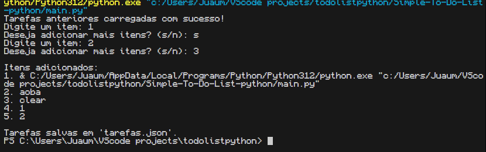

# ✅ ToDo List Python v1.0

Um aplicativo simples de **lista de tarefas no terminal**, feito com Python.  
Ideal para praticar lógica de programação, manipulação de arquivos e uso de JSON.

Este programa permite **adicionar tarefas**, que são **salvas automaticamente em um arquivo `.json`**, garantindo que suas anotações não se percam entre sessões.

---

## 📌 Funcionalidades

- ➕ Adicionar tarefas pelo terminal (via `input`)
- 💾 Salvamento automático em arquivo JSON (`tarefas.json`)
- 🔁 Carrega tarefas automaticamente se o arquivo já existir
- 🧠 Simples, leve e ótimo para iniciantes em Python
- 📂 Arquivo `.json` legível, com indentação e acentuação preservada
- 💻 Interface em terminal — não possui interface gráfica

---

## 🚀 Como usar

### 1. Clone este repositório

```bash
git clone https://github.com/gwent30000/Simple-To-Do-List-python.git
```

2. Acesse a pasta do projeto

cd Simple-To-Do-List-python

3.  Execute o programa:

python main.py

### 🖥️ Exemplo de uso:



